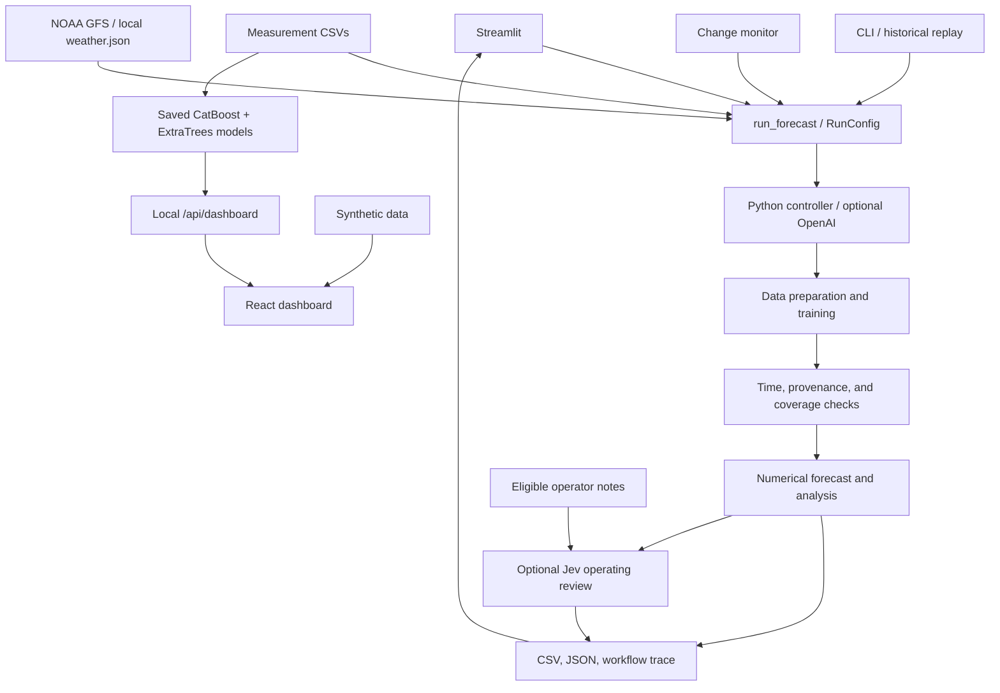

# WindScope — wind-power forecasting

WindScope is the **imokazakhstan** team's project for HackAlem AI. The application predicts **hourly normalized active power for two wind turbines, 24 or 48 hours ahead**, using historical measurements and weather forecasts. It combines data preparation, model training, input eligibility checks, forecasting, and report generation in one reproducible workflow.

Numerical predictions come from a machine learning model. An optional OpenAI agent coordinates tool calls and explains the results. Jev can review near-term operating concerns and recommend a human check. The core forecast workflow requires neither an AI API key nor a GPU.

The repository contains two interfaces:

- **Streamlit** — the application for running forecasts, uploading measurements, and downloading results.
- **React dashboard** — a map and charts that display explicitly labeled synthetic data in standalone demo mode. A local Python API can instead serve archived forecasts from the saved models and original turbine CSVs.

## Implemented features

| Feature | Current implementation |
|---|---|
| Demo without API keys | Built-in synthetic measurements and weather; works offline after installation |
| Measurement import | Organizer CSVs uploaded through Streamlit or read from local files; a canonical observation format is also supported |
| Data preparation | Format, timestamp, and numerical validation; complete groups of six 10-minute intervals are averaged into hourly values |
| Weather retrieval | NOAA GFS cycle selection, wind and temperature downloads, local caching, and provenance checks |
| Forecasting | A separate `HistGradientBoostingRegressor` per turbine for weather-driven runs; saved CatBoost power and ExtraTrees wind models for offline local-history runs; an empirical power curve for baseline and demo |
| Model validation | Chronological holdout and comparison with the baseline using MAE, RMSE, and bias |
| Historical and current forecasts | `historical` and `live` modes, 24/48-hour horizons, and sequential replay of historical issues through the CLI |
| Automatic recalculation | Detects changes to CSVs, configuration, model artifacts, and eligible weather releases; retains the last successful result if an update fails |
| Audit and export | Forecast CSV, JSON reports, source hashes, and a workflow trace; full report ZIP download from Streamlit |
| OpenAI agent | Optional controller with tool calling and fallback to the local Python workflow if the API fails |
| Jev operational review | Optional TypeSafe review of the next three hours, using eligible operator notes and compact forecast context; recommends what to check without changing power predictions |
| React interface | Turbine and day selection, map, actual-versus-predicted charts, weather cards, CSV export, responsive layout, and a local API for archived forecasts |
| Containers | Dockerfiles and Docker Compose for the dashboard and optional Streamlit service |

Missing measurements are not replaced with zero production. Demo data is never substituted for missing real inputs.

## Technologies and architecture

| Layer | Technologies |
|---|---|
| Computation and data processing | Python 3.11+, dataclasses, standard CSV/JSON libraries, `zoneinfo` |
| Machine learning | scikit-learn, CatBoost, histogram gradient boosting, ExtraTrees wind model, empirical power curve |
| Forecasting interface | Streamlit |
| Weather data | NOAA GFS in GRIB2 format, ecCodes, NOAA's public archive on AWS S3 |
| Optional AI controller | OpenAI Python SDK, Responses API with function calling; `python-dotenv` for local configuration |
| Optional operating review | TypeSafe Jev via a bounded HTTP request; `python-dotenv` loads `TYPESAFE_API_KEY` from the server's local `.env` |
| Dashboard | React, TypeScript, Vite, Recharts, Leaflet, Lucide |
| Verification | Python `unittest`, Streamlit AppTest, Vitest, Playwright, axe-core, Prettier |
| Container runtime | Docker Compose, nginx for the static frontend |



The shared entry point is `wind_forecast.agent.application.run_forecast`. The controller executes seven tools in sequence: `fetch_weather`, `prepare_data`, `train_model`, `audit_inputs`, `predict_power`, `inspect_forecast`, and `save_forecast`. Python code enforces the order and validation checks, including when OpenAI is enabled.

The weather-driven gradient boosting model uses wind speed, temperature, and cyclic time-of-day and seasonal features. Training requires at least **168 valid hourly observations per turbine**. After validation on the most recent observations, the model is refitted on all eligible history. The optional offline `local_history` route uses committed CatBoost and ExtraTrees weights with separate eligibility checks.

Protection against future-data leakage accounts for measurement time, measurement availability, weather issue time, and the training cutoff. Historical mode rejects synthetic, unverified, or late-published weather. Shared timestamps are normalized to UTC; an hourly forecast is labeled by the **end of its interval**.

Results and state are stored in local files; a database is not required. Each run creates a separate version. Application states are `completed`, `blocked`, and `failed`; a completed forecast may include warnings and have a `degraded` status.

### Repository structure

```text
app.py                         # Streamlit interface
src/wind_forecast/
  contracts.py                 # Shared request, observation, and forecast records
  agent/                       # Orchestration, monitoring, integrations, and artifacts
    dashboard.py               # Local React API and static server
    local_models.py            # Saved CatBoost and ExtraTrees model integration
  data/                        # Observation loading and adaptation
  weather/                     # Weather providers, GFS extraction, and export
  models/                      # Gradient boosting and baseline model
  evaluation/                  # Evaluation metrics
scripts/                       # Single runs, import, replay, and monitoring
examples/                      # Configurations and a sample model adapter
frontend/                      # React dashboard, API contract, Docker, and tests
tests/                         # Python application tests
docs/                          # Architecture, sources, models, and guides
data/                          # Local measurements and cache; data is excluded from Git
runs/                          # Forecast versions and monitor state
```

The main application retrieves NOAA data through `agent/noaa_archive.py`. The `weather/` module contains a separate provider with its own cache and a compatible `weather.json` export; the cache formats are not interchangeable. See the [architecture overview](docs/architecture.md) and [data guide](docs/data.md).

## Installation and launch

### 1. Python application

Requirements: **Python 3.11 or newer**, Git, and internet access to install dependencies. Unless stated otherwise, run the commands below from the repository root.

```bash
git clone https://github.com/BAITC-Hacks/hack-79a39f16-imokazakhstan.git
cd hack-79a39f16-imokazakhstan
python -m venv .venv
```

Activate the environment on Linux/macOS:

```bash
source .venv/bin/activate
```

Or in Windows PowerShell:

```powershell
.\.venv\Scripts\Activate.ps1
```

Install dependencies and start the application:

```bash
python -m pip install -r requirements.txt
python -m streamlit run app.py
```

Open [Streamlit at localhost:8501](http://localhost:8501). If you only need the demo interface, use `python -m pip install -e ".[app]"` instead of the full installation. The complete test suite also requires the ML dependencies.

For an initial check, leave **Demo data** selected, choose the horizon and turbines, and click **Run demo forecast**. The chart, hourly values, and download buttons appear under **Read your forecast**. No API keys are required.

### 2. Forecasting from real measurements

1. Obtain the organizer's original CSVs. Save them as `data/raw/turbine_1.csv` and `data/raw/turbine_2.csv`, or upload them in Streamlit under **Your measurements → Measurement files**.
2. Set the forecast issue time in UTC, horizon, and turbines. An example historical issue is **February 1, 2026, at 00:00 UTC**.
3. Review the source CSV timezone, whether timestamps mark the start or end of each 10-minute interval, and the reporting delay. Acknowledge your choices with **Use these timestamp assumptions**. Default values are not organizer-confirmed facts.
4. Keep **Gradient boosting ML** and the automatic NOAA source selected, or upload a suitable `weather.json` with complete coverage and provenance information.
5. Click **Generate forecast**. NOAA retrieval requires internet access and an installed ecCodes decoder, including for cached-source metadata checks. A suitable local weather bundle allows the calculation to run offline.

For the CLI, copy `examples/historical_request.json` to `my_real_request.json`, set the CSV paths, review the timestamp settings, and set `assumptions_confirmed: true` after checking them:

```bash
python scripts/run_forecast.py --config my_real_request.json
```

The supplied example deliberately sets `assumptions_confirmed` to `false`: using it unchanged blocks a real-data run. Request fields and the weather bundle format are documented in [Application I/O](docs/application_io.md).

### Optional Jev review

The team uses the shared environment variable `TYPESAFE_API_KEY` for TypeSafe Jev.
Copy `.env.example` to an ignored local `.env` and fill in the TypeSafe key, or set
the variable in the server environment. `TYPESAFE_MODEL` optionally overrides the
default `jev-1.13.0`. This is separate from `OPENAI_API_KEY`; the repository does
not include a shared credential. Restart Streamlit after changing an already loaded
key. In Streamlit, select **Your measurements**, open
**Optional settings**, and enable **Jev: review the next 3 hours** before you
generate a weather-driven forecast. The offline **Local saved models** route does
not invoke Jev. You can add an operator note with its affected turbines,
UTC availability time, and expiry time. Historical notes must have been known
by the selected forecast issue time.

The **Jev · Next 3 hours** card appears below the forecast analysis. It labels
reported issues such as maintenance, curtailment, icing concerns, or faulty
measurements and suggests an immediate review step. These are advisory judgments
about the supplied evidence; the numerical ML model still produces every hourly
power value. The demo forecast remains offline. Enabled real runs add
`operations.json` to the full report ZIP, and automatic updates repeat the review
when forecast inputs or a configured notes file change. See the
[Jev workflow and teammate handoff](docs/jev_operations.md).

### 3. Automatic updates

In Streamlit, enable **Keep forecast updated automatically**. Inputs are checked every five minutes while the page session is active. To run independently of the browser, start the CLI process:

```bash
python scripts/watch_forecast.py --config my_real_request.json --state-dir runs/monitor-case --interval-seconds 300
```

For current forecasts, prepare a configuration based on `examples/live_request.json` and add `--live`. Review paths, timestamp assumptions, and the `controller` field: the example uses `openai`; set it to `deterministic` for local control. In live mode, the monitor advances the issue time to the current UTC hour.

New measurements become available when the configured CSVs are updated on the server. Browser uploads are file snapshots. Unchanged inputs do not trigger retraining. The CLI process must remain running; `Ctrl+C` stops it while retaining its state.

### 4. React dashboard

Requires **Node.js 22.12.0 or newer**; the container build uses Node.js 22.

```bash
cd frontend
npm ci
npm run dev
```

Open the address printed by Vite, usually [localhost:5173](http://localhost:5173). Use `npm run build` to build the frontend and `npm run preview` to preview the build locally.

The initial configuration is `frontend/public/runtime-config.json`, with `demo` mode enabled. It does not require a Python server. `DASHBOARD_BACKEND_URL` only adds a navigation link to Streamlit; it does not connect the data.

To see forecasts from the saved local models in React, place the original CSVs at
`data/raw/turbine_1.csv` and `data/raw/turbine_2.csv`, then run from the repository
root:

```bash
python -m pip install -e ".[app,local]"
cd frontend
npm ci
npm run build
cd ..
PYTHONPATH=src python -m wind_forecast.agent.dashboard --config examples/local_request.json
```

Open [localhost:8000](http://127.0.0.1:8000) and select archive February 1, 2,
or 3, 2026. The server provides `GET /api/dashboard` and serves the compiled React
site in API mode. Its example issue is historical; February actual values are
absent because the supplied CSVs end January 31. Streamlit also offers **Local
saved models (offline)**. See [local integration](docs/local_integration.md) for
the CSV assumptions, issue-time limits, API behavior, and persistent worker.

### 5. Running with Docker

With Docker Engine/Desktop and Compose v2 installed, run from the repository root:

```bash
docker compose -f frontend/compose.yaml up --build -d
```

The dashboard will be available at [localhost:8080](http://localhost:8080). To start it alongside Streamlit:

```bash
docker compose -f frontend/compose.yaml --profile backend up --build -d
```

Streamlit uses [localhost:8501](http://localhost:8501). The `backend` profile starts the second application but does not implement the dashboard API. To run the connected local API and persistent worker, use `docker compose -f frontend/compose.yaml -f frontend/compose.local.yaml --profile local up --build -d` after supplying the original CSVs. Container execution still needs verification in the target environment. See [local integration](docs/local_integration.md) and [frontend setup](frontend/README.md).

## Verification example

### Reproducible forecast without network access or keys

After installation, run from the repository root:

```bash
python scripts/run_forecast.py --config examples/fixture_request.json
```

Expected result:

- Exit code `0` and `state: "completed"` in the JSON response.
- **96 forecast records**: 2 turbines × 48 hours.
- A new directory under `runs/application/`, identified by `run_dir`.
- `is_synthetic: true` and `row_count: 96` in `manifest.json`.
- One row per turbine/hour pair in `forecast.csv`, with `lead_hours` from 1 to 48.

The example sets the issue time to `2026-02-01T00:00:00+00:00`: the first prediction covers the hour ending at `2026-02-01T01:00:00+00:00`, and the last covers the hour ending at `2026-02-03T00:00:00+00:00`. This is a **synthetic check of application behavior**, not an accuracy evaluation on real turbines. Warnings and a `degraded` status are acceptable for the demo result.

Files produced by a successful run:

| File | Contents |
|---|---|
| `forecast.csv` | `turbine_id`, `issue_time`, `valid_time`, `lead_hours`, `prediction`, and optional `p10/p50/p90` |
| `manifest.json` | Model and weather identifiers, hashes, row count, status, and synthetic-data flag |
| `request.json` | Run parameters |
| `report.json` | Assumptions, data quality, training details, and result analysis |
| `operations.json` | Optional Jev inputs, typed judgments, probabilities, and recommended review steps |
| `weather.json` | The weather bundle used for the forecast |
| `trace.jsonl` | Workflow execution log |
| `summary.md`, `response.json` | Plain-text summary and full application response |

For NOAA runs, `weather_source_manifest.json` is also saved when the source manifest is available in the cache. The contract supports quantile fields; the built-in ML model does not estimate uncertainty intervals.

To check the monitor with a single poll:

```bash
python scripts/watch_forecast.py --config examples/watch_request.json --once
```

The first run should produce a new completed forecast. Subsequent polls reuse the saved state and do not necessarily rerun the model.

### Automated tests

After installing the full Python dependencies:

```bash
python -m unittest discover -s tests -v
python -m unittest discover -s src/wind_forecast/data/tests -v
python -m unittest discover -s src/wind_forecast/weather/tests -v
```

Tests cover data preparation, training time boundaries, weather coverage and provenance, agent stages, monitor recovery, and Streamlit. External APIs are tested with mocked responses: passing tests does not establish live service availability or forecast accuracy.

Run frontend checks from `frontend/` after `npm ci`:

```bash
npm test
npm run build
npx playwright install chromium
npm run test:e2e
npm run format:check
```

## Data and external services

### Turbine measurements

Real measurements come from organizer-supplied CSVs sampled every 10 minutes. The importer expects the following exact column headers; retain their original Russian names:

```text
ID
Статистическое время
Средняя скорость ветра(m/s)
Нормализованная активная мощность
Средняя температура окружающей среды(°C)
```

These represent the row ID, measurement timestamp, average wind speed in m/s, normalized active power, and average ambient temperature in °C.

According to the saved [source dataset profile](docs/dataset_profile.md), measurements cover **March 11, 2023–January 31, 2026**. Although the original filenames mention February 28, 2026, the inspected files contain no February records. The CSVs are not included in Git, so anyone cloning the repository must provide them separately.

The demo uses generators in `demo_data.py` and `weather/mock.py`; a separate dashboard dataset is generated in `frontend/src/data.ts`. Its power values, statuses, and weather events are illustrative.

### Services

| Service | Purpose | Requirements |
|---|---|---|
| [NOAA GFS on AWS](https://registry.opendata.aws/noaa-gfs-bdp-pds/) | Original forecast releases: wind components at 100 m, optionally 10 m, and temperature at 2 m; nearest 0.25° grid cell | Automatic retrieval requires internet access; no weather API key or AWS account is needed |
| OpenAI API | Optional tool coordination and textual explanations based on local calculation summaries | Requires a key and access to the selected model; API calls may incur charges |
| TypeSafe Jev | Optional near-term operating review; no numerical power prediction | Set `TYPESAFE_API_KEY` in the server environment or ignored `.env`; API calls may incur charges |
| OpenStreetMap | Street-map tiles for the React map | External tiles load when the **Street** layer is selected; the default schematic works without them |

To enable OpenAI, copy `.env.example` to `.env` and set `OPENAI_API_KEY` and, optionally, `OPENAI_MODEL`. The model default in the code is `gpt-4.1-mini`; your API project must have access to it. Then enable **Use OpenAI agent** in Streamlit or set `controller: "openai"` in the configuration. The API receives request and tool-result summaries, not raw CSVs. The controller's default limit is eight API calls, with up to 900 output tokens per call.

OpenAI and TypeSafe keys stay on the server in environment variables or a local
`.env`. `TYPESAFE_API_KEY` is the common Jev configuration variable for teammates;
`.env.example` lists it without a value. No key belongs in forecast requests or
public frontend configuration.
An external numerical model can be connected through a trusted Python factory
and an artifact with metadata; the contract is documented in
[Application I/O](docs/application_io.md).

## Known limitations

- **Forecast accuracy for February 2026 has not been established.** The source data lacks the corresponding target measurements. ML diagnostics use observed weather and are not equivalent to a 24–48-hour forecast evaluation using archived weather forecasts.
- **Output is normalized power.** The normalization definition and rated capacities need confirmation. Values cannot automatically be interpreted as MW/MWh, and arbitrary input data should not be assumed to use a `[0, 1]` scale.
- **Timestamp assumptions need verification.** The CSVs do not specify a timezone, interval-start/end convention, or availability delay. Acknowledging settings in the application records the user's choice but does not establish the source's meaning.
- **Gridded weather differs from turbine measurements.** GFS fields represent values at specific times; using them to predict hourly mean power is an approximation. Wind height and spatial resolution also affect accuracy.
- **Archive or network access may be unavailable.** Forecasting is blocked when no eligible original release is available. S3 metadata supports availability in the mirror used by the application, not NOAA's exact first-publication time. A `verified_original` label in third-party JSON is not independent proof of provenance.
- **Live mode does not create a measurement feed.** Current turbine conditions require fresh CSVs or a separate integration. Historical data can train the model but cannot establish the equipment's current operating state.
- **The connected React mode is an archived example, not a live SCADA feed.** The backend maps `T1/T2` to the two supplied CSVs, but physical turbine IDs are not independently attested. It converts Python interval-end timestamps into React interval starts. Current data needs a fresh measurement source.
- **Jev recommendations are advisory.** Its routing thresholds have not been calibrated on labeled turbine incidents. Operator notes are self-reported; TypeSafe judgments do not establish that a fault occurred.
- **The February submission is incomplete.** A real local-model replay completed one of 29 daily issues; 96 of 1,344 forecast rows are present. Other issues need eligible model cutoffs and fresh SCADA context or archived weather. See the [local integration audit](docs/local_integration.md#audit-changes--february-readiness).
- **Demo weather events and statuses are illustrative.** Current Python contracts do not contain observed wind direction or operational status; wind and temperature fields do not establish precipitation or icing. Integration requirements are listed in [frontend/INTEGRATION.md](frontend/INTEGRATION.md).
- **Container execution requires separate verification in the target environment.** The frontend documentation notes that image builds and container health checks had not yet been performed. Python dependencies use version ranges without a lock file; record the installed versions to reproduce an environment.

## Deployed version

**The repository does not list a public deployment URL.** After local startup, Streamlit is available at [localhost:8501](http://localhost:8501), and the containerized dashboard is available at [localhost:8080](http://localhost:8080). These are local addresses, not a public demo.

## Further documentation

- [Streamlit user guide](docs/website_guide.md)
- [Jev operational review and teammate handoff](docs/jev_operations.md)
- [Local saved models, dashboard API, and replay audit](docs/local_integration.md)
- [Architecture and time constraints](docs/architecture.md)
- [Input, output, and integration formats](docs/application_io.md)
- [Autonomous agent and monitoring](docs/autonomous_agent.md)
- [ML model and diagnostic results](docs/model_ml.md)
- [Weather sources](docs/weather_sources.md) and [archive validation](docs/weather_archive.md)
- [Data and weather export](docs/data.md), [CSV profile](docs/dataset_profile.md)
- [Dashboard setup](frontend/README.md), [API contract](frontend/API.md), and [integration plan](frontend/INTEGRATION.md)
- [HackAlem AI case brief](docs/HackAlem%20AI_%20Agentic%20AI%20Case.pdf)

Follow [AGENTS.md](AGENTS.md) when contributing. Original CSVs, weather caches, `.env`, and generated run results are excluded from Git; the saved local-model weights and their metadata are committed.
