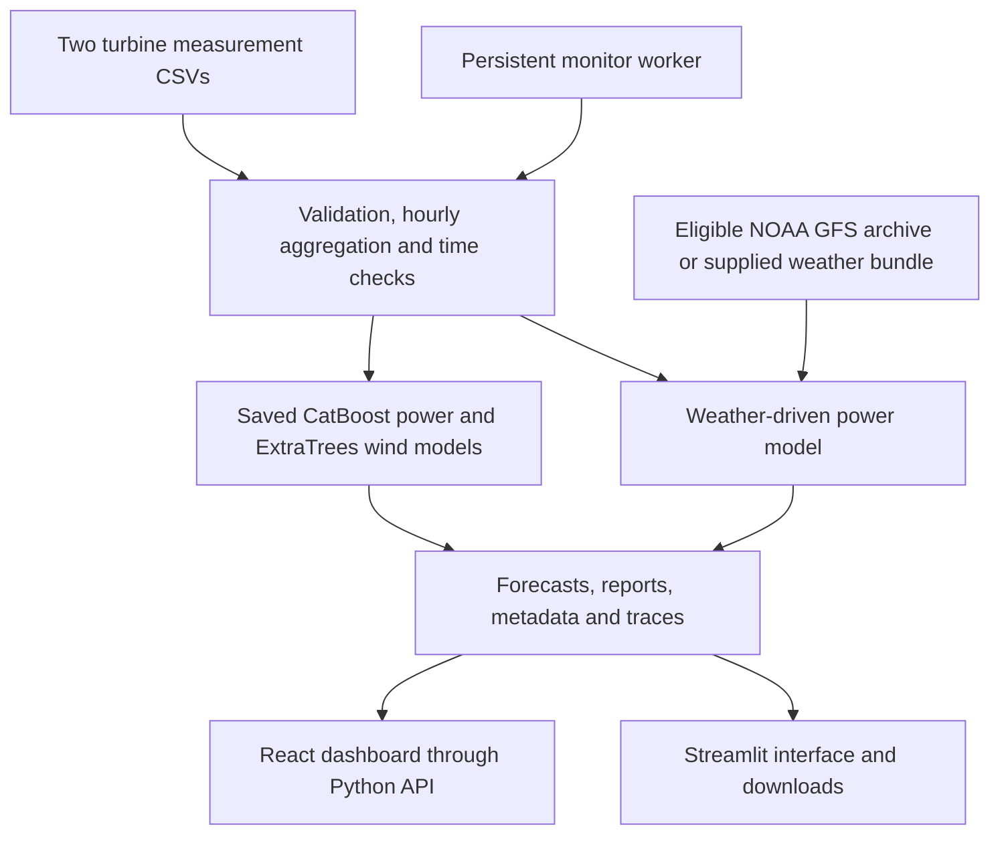

# WindScope — Wind and Power Forecasting

WindScope is a hackathon prototype for forecasting the **hourly normalized active power of two wind turbines, 24 or 48 hours ahead**. It helps wind-farm operators and analysts inspect expected generation, compare available measurements with predictions, and understand the data behind each forecast.

The project includes a React dashboard, a Streamlit interface, saved CPU models, and an auditable forecasting workflow. A synthetic demonstration runs without external services after dependencies are installed. Real forecasts require the original measurement files, which are not distributed in this repository.

## What is implemented

- **Power forecasts:** a saved CatBoost model using the history of both turbines, with approximate empirical uncertainty bands.
- **Wind-speed forecasts:** a separate saved ExtraTrees model producing hourly wind predictions.
- **Interactive dashboard:** turbine, forecast issue, and date selection; power and wind charts; available actual measurements; CSV export.
- **Alternative weather-driven forecasting:** NOAA GFS archived forecasts or a supplied weather bundle, combined with a per-turbine gradient boosting model or an empirical power-curve baseline.
- **Traceable runs:** forecast issue and lead times, source hashes, model metadata, input assumptions, reports, and execution traces.
- **Background monitoring:** a standalone worker detects changed inputs, preserves state between restarts, and retains the last successful result when an update fails.
- **Historical replay:** daily forecast issues remain distinguishable, and a strict submission check reports missing coverage or ineligible inputs.
- **Optional AI assistance:** OpenAI workflow orchestration and TypeSafe Jev operational review on the weather-driven path. Numerical forecasts come from the forecasting models.

## How it works

1. Supply the two turbine CSV files and select a forecast issue, horizon, and timestamp interpretation.
2. The application validates the measurements and averages complete groups of six ten-minute intervals into hourly observations. Missing hours are not replaced with zero production.
3. It filters observations by measurement time and availability time, and checks that model training does not extend beyond the forecast issue.
4. In `local_history` mode, saved CatBoost and ExtraTrees models predict power and wind independently. The alternative weather-driven mode retrieves eligible forecast weather before estimating power.
5. The application validates and saves the result. The dashboard presents the selected issue, hourly predictions, uncertainty where available, and actual measurements where present.

For the saved local models, forecasts are issued daily at **06:00 UTC+5**, with up to **48 hourly mean values per turbine**. Power is predicted directly from history; it is not calculated by passing the separate wind forecast through a lookup table.

Backend timestamps identify the **end** of each hourly interval. The React adapter converts them to interval-start timestamps. Power remains in normalized units, and wind speed is in m/s. An established normalization factor and rated turbine capacity are required before converting power to MW.

## Architecture



| Component | Location | Responsibility |
| --- | --- | --- |
| React dashboard | `frontend/` | Charts, turbine/date/issue selection, map, and downloads |
| Dashboard API | `src/wind_forecast/agent/dashboard.py` | Serve the compiled dashboard and `/api/dashboard` |
| Application and local-model adapter | `src/wind_forecast/agent/` | Configuration, orchestration, eligibility checks, and artifacts |
| Streamlit interface | `app.py` | Offline demo, measurement input, forecast execution, and reports |
| Models | `src/wind_forecast/models/` | Saved-model inference, history features, and weather-to-power models |
| Data and weather | `src/wind_forecast/data/`, `src/wind_forecast/weather/` | Observation loading and weather-provider components |
| Shared contracts | `src/wind_forecast/contracts.py` | Requests, observations, weather bundles, and forecast records |
| Evaluation | `src/wind_forecast/evaluation/` | Metrics and archived experiment results |
| CLI and monitor | `scripts/` | Single runs, historical replay, and browser-independent updates |

## Technology stack

| Area | Technologies |
| --- | --- |
| Backend | Python 3.11+, Streamlit, Python HTTP server |
| Local forecasting | CatBoost, scikit-learn ExtraTrees, pandas, NumPy, joblib |
| Weather-driven forecasting | scikit-learn histogram gradient boosting, empirical power curve, ecCodes GRIB decoding |
| Frontend | React, TypeScript, Vite, Recharts, Leaflet, Lucide icons |
| Optional services | NOAA GFS archive, OpenAI API, TypeSafe Jev, OpenStreetMap tiles |
| Deployment and testing | Docker Compose, nginx, Python unittest, Vitest, Playwright |

NVIDIA Brev was used for GPU model experiments. GPU access, PyTorch, and external API credentials are **not required for the selected local models**. Transformer and LoRA experiments are documented in the research archive; their weights are not part of the deployed model set.

## Installation and startup

Run commands from the repository root unless a step explicitly changes directories. Python **3.11 or 3.12** is recommended for the saved-model environment. The React build requires **Node.js 22.12 or newer** and npm.

### 1. Set up Python

```bash
git clone https://github.com/BAITC-Hacks/hack-79a39f16-imokazakhstan.git
cd hack-79a39f16-imokazakhstan
python -m venv .venv
source .venv/bin/activate
python -m pip install -e ".[app,local]"
```

On Windows PowerShell, replace the activation command with:

```powershell
.venv\Scripts\Activate.ps1
```

For the Streamlit synthetic demo alone, `python -m pip install -e ".[app]"` is sufficient. To include the optional OpenAI client and NOAA decoder as well, install:

```bash
python -m pip install -r requirements.txt
```

### 2. Run the offline demonstration

```bash
python -m streamlit run app.py
```

Open **http://localhost:8501**, keep **Demo data** selected, choose a horizon, and click **Run demo forecast**. This mode uses explicitly synthetic inputs and results. It needs neither measurement files nor API keys, and forecast generation works offline after installation.

### 3. Run the React dashboard with saved models

Place the original measurement files at:

```text
data/raw/turbine_1.csv
data/raw/turbine_2.csv
```

Both files are required because the power model uses neighboring-turbine history. The selected weights and their metadata are already tracked in Git:

```text
src/wind_forecast/models/artifacts/deploy-final/catboost_neighbor.cbm
src/wind_forecast/models/artifacts/deploy-final/catboost_neighbor.metadata.json
src/wind_forecast/models/artifacts/wind-audit/wind_model.joblib
src/wind_forecast/models/artifacts/wind-audit/metadata.json
```

Build and serve the dashboard:

```bash
cd frontend
npm ci
npm run build
cd ..
python -m wind_forecast.agent.dashboard --config examples/local_request.json
```

Open **http://127.0.0.1:8000**. This serves the compiled React app and local-model API together. The example opens the archived **February 1, 2026, 06:00 UTC+5** forecast. It does not represent today's operating conditions.

The standalone Vite/frontend configuration defaults to demo data; use the Python server above to inspect the connected local models. Streamlit also exposes **Local saved models (offline)** under the real-measurement workflow.

### 4. Run forecasts without a browser

```bash
# Synthetic, offline end-to-end run: 2 turbines × 48 hours.
python scripts/run_forecast.py --config examples/fixture_request.json

# Saved-model forecast; requires both original measurement files.
python scripts/run_forecast.py --config examples/local_request.json

# Monitor the configured historical issue independently of the browser.
python scripts/watch_forecast.py --config examples/local_request.json \
  --state-dir runs/local-monitor --interval-seconds 300
```

Results are written under `runs/application/`. The local-model run includes power and wind CSVs, model/source metadata, a report, and a trace. The supplied configuration deliberately fixes a historical issue. Daily operation requires fresh observations, a separate configuration with `mode="live"`, and the worker's `--live` option. Local-model issues then advance daily at 06:00 UTC+5.

### 5. Optional Docker deployment

With Docker Compose installed and both CSVs supplied:

```bash
docker compose -f frontend/compose.yaml -f frontend/compose.local.yaml \
  --profile local up --build -d
```

The dashboard is configured at **http://localhost:8080**. The local overlay adds an API and monitor worker, persistent run/cache volumes, read-only input mounts, restart policies, and resource limits. It uses the same fixed historical example by default.

**Verification status:** the CLI worker's restart behavior was exercised, but Docker image builds, container health checks, and container-level recovery have not been verified in the development environment.

## A reproducible judging scenario

### Without access to the original dataset

1. Install the Streamlit dependencies and start `app.py` as above.
2. Keep **Demo data**, choose both turbines and a **48-hour** horizon.
3. Click **Run demo forecast** and inspect the chart and hourly table.
4. Download the forecast CSV: expect **96 rows**, with turbine, issue time, valid time, lead, and prediction fields.
5. Confirm that the run is labeled synthetic. This demonstrates the workflow, not real-world forecasting accuracy.

The fixture CLI command provides the same offline workflow without opening the UI.

### With the original dataset

1. Supply both CSVs and start the connected React dashboard using `examples/local_request.json`.
2. Keep the February 1, 2026, 06:00 UTC+5 issue. Select archive dates February 1, 2, and 3 to inspect its complete 48-hour window.
3. Inspect power and wind predictions and switch between turbines. February actual measurements should be absent, not filled with zeros.
4. Run the local-model CLI command and inspect the saved forecast, wind forecast, source hashes, training cutoff, and trace under `runs/application/`.

### Automated checks

```bash
python -m unittest discover -s tests -v
python -m unittest discover -s src/wind_forecast/data/tests -v
python -m unittest discover -s src/wind_forecast/weather/tests -v
python -m unittest discover -s src/wind_forecast/models -p "test*.py" -v
cd frontend
npm test
npm run build
npx playwright install chromium
npm run test:e2e
```

Some integration checks require the original CSVs. The real-dashboard browser cases additionally require a running API and `LOCAL_DASHBOARD_URL` set to its address. The [integration report](docs/local_integration.md) records the previous verification results: 110 Python tests, 41 frontend unit tests, and 18 browser cases including two connected-model cases. These checks establish execution behavior, not forecast accuracy.

## Data and integrations

**Measurements.** The supplied turbine files contain ten-minute timestamps, wind speed, normalized active power, and ambient temperature. The records span March 11, 2023 through **January 31, 2026 at 23:50**, despite filenames mentioning February 28. Raw files are excluded from Git. See the [dataset profile](docs/dataset_profile.md) for columns, coverage, missing records, and hashes.

**Timestamp assumptions.** The local configuration uses fixed UTC+5 (`Etc/GMT-5`), interval-start source timestamps, and zero reporting delay. UTC+5 was specified by the operator; the files themselves do not declare these conventions. Review the assumptions and turbine identities before treating the run as a verified submission. Internal cross-module timestamps are timezone-aware UTC.

**Weather.** The saved local models use no future weather. The alternative application path retrieves original NOAA GFS forecasts, checks their availability relative to the issue time, and retains source/version evidence. It requires network access for automatic retrieval; an eligible local weather bundle is also supported. See [weather sources](docs/weather_sources.md) and [weather-driven model details](docs/model_ml.md).

**Optional AI.** On the weather-driven path, OpenAI can coordinate the application's tools, while Jev can review the next three hours using forecast context and operator notes. Jev's judgments do not modify numerical power predictions and are not statistical forecast confidence intervals. The local saved-model path uses neither service. Configure credentials through environment variables or an ignored `.env`; never commit keys. See [Jev integration](docs/jev_operations.md).

**Map.** The dashboard offers an offline schematic map; switching to street tiles uses an external map service. This is independent of numerical forecasting.

## Recorded model evaluation

The research archive compares **19 configurations** over **33,263 matched turbine–issue–hour pairs**, covering February 2025 through January 2026 with daily 06:00 UTC+5 issues and a 48-hour horizon. Historical evaluation used monthly training cutoffs; the final saved weights must not be reused to score earlier issues.

| Forecast | Selected model | RMSE | MAE |
| --- | --- | ---: | ---: |
| Normalized power | CatBoost with neighboring-turbine history | 0.335738 | 0.290722 |
| Wind speed | ExtraTrees | 3.477819 m/s | 2.882098 m/s |

RMSE measures prediction error and penalizes large mistakes more strongly; lower is better. Normalized-power RMSE is in the original normalized scale, **not a percentage accuracy score**. The previous power approach had RMSE 0.340804 and MAE 0.279409: the selected model improves RMSE but worsens MAE. Transformer and LoRA candidates did not outperform it on the recorded comparison.

These are baseline results with substantial remaining error. The comparison periods informed model selection and are not an untouched final test. Weather-to-power validation using measured weather must also be distinguished from an end-to-end forecast using weather known 24–48 hours in advance.

See [model details](docs/model.md) and the [experiment archive](src/wind_forecast/evaluation/archive/README.md) for configurations, monthly metrics, resource measurements, and removed experiments.

## Current limitations

- **February 2026 accuracy is unknown:** the supplied files contain no February actual measurements.
- **A complete real February replay is not ready.** The recorded local-model audit completed one of 29 requested daily issues and covered 96 of 1,344 February turbine-hour rows. Earlier issues conflict with the final model cutoff; later issues lack fresh observation context. See the [replay audit](src/wind_forecast/evaluation/archive/integration-replay-audit.json). Missing forecasts are not fabricated.
- **Saved weights have a fixed training cutoff:** January 31, 2026 at 19:00 UTC. Local inference requires at least 18 valid power hours in the preceding day. Updating observations does not automatically retrain these weights.
- **Uncertainty is approximate:** the empirical 80% power bands are broad, do not guarantee future coverage, and need recalibration as new errors become available.
- **No MW/MWh claim:** rated capacity and the normalization denominator are unconfirmed. Integrated normalized power is labeled in normalized-unit hours.
- **Hourly resolution only:** ten-minute input readings are aggregated; the application does not deliver validated ten-minute forecasts.
- **Neighbor history is a predictive feature, not a physical wake model.** General multi-farm scaling and explicit turbine-interaction modeling are not established.
- **Missing variables remain unknown:** the local models do not forecast temperature, wind direction, icing, equipment health, or turbine operating status.
- **Deployment remains a prototype:** the Python dashboard server is intended for local or trusted internal use, not an authenticated public service. Container deployment and paid AI integrations require their own operational verification.

## Deployment address

No public deployed application URL is confirmed in this repository. The supported local entry points are the connected React dashboard at **http://127.0.0.1:8000**, Streamlit at **http://localhost:8501**, and the configured Docker frontend at **http://localhost:8080**.

## Further documentation

- [Local models, dashboard API, monitoring, and integration status](docs/local_integration.md)
- [Application architecture and time/provenance rules](docs/architecture.md)
- [Application inputs, outputs, and adapter contracts](docs/application_io.md)
- [Background monitoring and recovery](docs/autonomous_agent.md)
- [Dataset coverage and source assumptions](docs/dataset_profile.md)
- [Selected models and experiment results](docs/model.md)
- [Contribution ownership](AGENTS.md)
