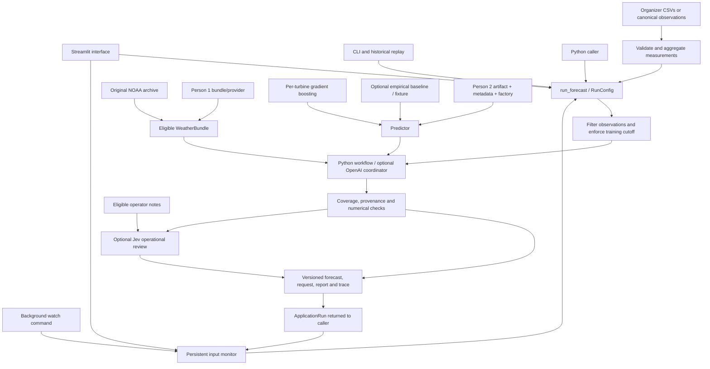

# Application architecture

The UI, Python API, and command-line runner call
`wind_forecast.agent.application.run_forecast`. The application owns orchestration,
time policy, validation, and persistence. Data, weather, and model interfaces
allow teammates to deliver their work independently.

## Modules and responsibilities

| Module | Responsibility |
|---|---|
| `agent/settings.py` | `RunConfig`, request validation, source-timezone-aware training cutoff, runtime environment settings |
| `agent/application.py` | Application service, input selection, ordered workflow tools, run states and artifacts |
| `agent/input_data.py` | Organizer CSV adapter, timestamp/numeric parsing, complete hourly means, quality report |
| `data/loader.py` | Existing canonical observation CSV loader owned by Person 1 |
| `agent/noaa_archive.py` | Original GFS fields, bounded downloads, local cache, source evidence |
| `agent/noaa_updates.py` | Select newest complete eligible cycle and fingerprint original object metadata |
| `agent/monitor.py`, `scripts/watch_forecast.py` | Persistent change detection, automatic retries and recalculation |
| `agent/integrations.py` | Weather bundle selection and trusted model factory loading |
| `models/base.py`, `models/power_curve.py` | Shared predictor protocol and empirical baseline |
| `models/gradient_boosting.py` | Per-turbine ML, chronological holdout, data-quality diagnostics and final fit |
| `agent/openai_controller.py` | Bounded Responses API orchestration using application-owned tool closures |
| `agent/jev.py` | Optional three-hour operational review: time-filtered notes, typed Jev judgments and auditable review policy |
| `agent/artifacts.py` | Versioned forecast CSV, manifest, and trace persistence |
| `app.py`, `scripts/run_forecast.py` | Interface and command-line/replay entry points |

Application adapters live under Person 3's integration area. Existing Person 1
and Person 2 modules remain independent replacement points. In particular,
`weather/noaa_gfs.py` is Person 1's implemented provider with cache-only replay
and optional retrieval of original 10 m forecast wind. The application's default
archive implementation remains `agent/noaa_archive.py` (100 m wind by default).
These providers retain separate cache formats. Person 1's export now includes
a shared `weather.json` bundle accepted by the application's bundle input;
source wind height stays explicit. See the integration section in `data.md`.

## One forecast run

1. Validate configuration, discover and retrieve eligible weather by coordinates.
2. Load and aggregate CSVs or supplied observation datasets. Keep observations whose measurement and availability times meet the issue
   time and configured observation policy.
3. Fit gradient boosting with a chronological holdout diagnostic and final refit,
   fit the chosen baseline, or verify/load a teammate model artifact.
4. Audit provenance and exact time coverage, call the predictor, and analyse
   its returned rows, wind coverage, input freshness and hourly changes.
5. If enabled, call Jev once within `inspect_forecast` to review the next three
   hours using eligible operator notes and compact forecast/measurement context.
   Preserve numerical checks and save advisory judgments separately from power.
6. Save outputs in a new directory and return `ApplicationRun`.

The tools are `fetch_weather`, `prepare_data`, `train_model`, `audit_inputs`,
`predict_power`, `inspect_forecast`, and `save_forecast`. The deterministic controller executes
them locally. OpenAI receives fixed request summaries and calls the same
zero-argument tools. The application enforces order and state so a tool call
cannot skip a check, change the target period, replace the model, or choose an
arbitrary output path.

API failures fall back to the Python workflow, preserving completed local work
and the fallback reason. Unavailable or invalid inputs remain blocked; an LLM
response cannot override those checks. Numerical outputs come from the
predictor. Optional generated commentary is separately labeled.

## Automatic recalculation

`ForecastMonitor.poll` compares a persistent signature of request settings,
measurement CSV contents, model artifact and metadata, and the eligible weather
version. With Jev enabled it also hashes an optional operations-note file.
NOAA discovery uses object metadata, so unchanged polls avoid GRIB field
downloads, training and paid OpenAI/Jev calls. Live mode advances to the current UTC
hour; historical mode keeps its issue fixed and never admits later weather.

A changed signature triggers the complete seven-tool cycle. The monitor checks
the inputs again after completion and only marks a stable successful signature
as consumed. It keeps the last successful response through source outages,
invalid updates and interrupted runs, and retries at the next scheduled poll.
An OS file lock prevents overlapping workers for one state directory. State is
replaced atomically; `history.jsonl` records triggers and forecast version paths.

The Streamlit checkbox polls while the browser session is active. The standalone
`scripts/watch_forecast.py` process continues independently of the browser and
reloads its config every cycle. Details are in [autonomous_agent.md](autonomous_agent.md).

The Jev adapter uses a fixed TypeSafe endpoint, a bounded request and no immediate
retries. It never changes `ForecastResult`. Unknown or failed judgments leave an
explicit unavailable review beside a usable forecast. See the
[operational review contract](jev_operations.md) for timestamp filtering,
provisional thresholds, evidence and failure states.

## Model and result analysis

Real runs with `model_kind="auto"` fit per-turbine histogram gradient boosting;
fixtures use the dependency-free empirical baseline. Teammate artifacts or
injected predictors take precedence. ML features are wind, temperature and
cyclic calendar values. The final model trains only on eligible history after
reporting a chronological holdout comparison against the empirical curve.
Validation uses measured weather, so it diagnoses the regression component;
full forecast accuracy needs original archived weather and future target labels.

Result inspection checks exact hourly coverage, finite values, ordered optional
quantiles and model/source identity. It also reports peak, mean, hourly changes,
measurement age and forecast wind outside the valid paired training range.
Input freshness or range findings mark the result as degraded while preserving
its numerical output. Values retain the supplied normalization scale.

## Time and leakage policy

Shared timestamps are timezone-aware and normalized to UTC. The raw exports
have naive timestamps: source timezone and interval convention must be explicit
assumptions in the report. Ambiguous/nonexistent local times are rejected. Six
aligned ten-minute intervals form one hourly mean, labeled by the **end** of the
hour. Incomplete hours are omitted and counted, never filled with zero production.

`observed_at` is the completed interval end. `available_at` adds the reporting
delay. Both must be no later than the simulated issue time. This prevents an
unfinished hour from becoming available at its beginning.

For `observation_policy="frozen_jan31"`, the limit is the earlier of issue time
and February 1, 2026 at 00:00 in the selected source zone, converted to UTC. The
comparison is inclusive because the last January interval ends at that boundary.
With `available`, the limit is the issue time. Model metadata must declare
`trained_through` at or before the same limit. Fitted scalers, feature selection,
calibration, and other transformations are part of training and obey the cutoff.

Weather initialization, availability, and retrieval have different meanings:

- `run_init_time`: when the meteorological model initialized.
- `available_at`: when every input in the bundle was obtainable.
- `retrieved_at`: when this application downloaded/read the archive.

Historical eligibility uses initialization and availability, not the later
retrieval time. An older forecast fetched today can be eligible if its evidence
supports the simulated issue time. Today's forecast and reanalysis cannot
replace a missing original historical forecast.

Output covers leads 1 through 24 or 48, with exactly one row per requested
`(turbine_id, valid_time)`. Valid times are UTC hour ends. NOAA inputs are
instantaneous forecast fields at those times; mapping them to hourly mean power
is a modeling approximation. The model team should evaluate and refine it.

## Provenance and repeatability

Source CSV SHA-256, observation assumptions, weather identity and source hash,
model metadata, input hash, request, and trace accompany the forecast. A model
file must match its metadata SHA-256 before its trusted factory loads it. The
application does not unpickle or import browser uploads as model code.

`verified_original` in a teammate bundle is a provider assertion backed by its
availability evidence; valid JSON alone cannot prove source history. The NOAA
provider preserves GRIB/index identity and source timestamps under its documented
archive policy. See [weather_archive.md](weather_archive.md) for limitations.

Repeated runs append directories. Rolling forecasts retain issue time when
valid times overlap. A separate latest-per-hour export selects the latest
eligible issue for each turbine/hour and retains the full replay record.
February target labels are absent from the supplied CSVs, so forecast generation
and accuracy evaluation must be reported separately.

## State and integration boundary

`ApplicationRun.state` is `completed`, `blocked`, or `failed`. Completed runs
contain validated rows but can carry warnings or a degraded forecast status.
Blocked runs identify missing/ineligible inputs. Failed runs record an execution
failure. Reports and traces explain the state without claiming that an absent
forecast exists.

Exact Python, configuration, weather, model, and output contracts are in
[application_io.md](application_io.md). Teammate models and independently
validated weather adapters replace the corresponding interfaces without
changing the UI's output contract.
