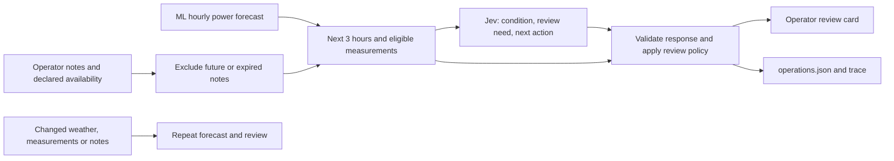

# Jev operational review

Jev helps an operator decide what needs attention during the **next three hours**.
It interprets English or Russian notes about maintenance, production limits,
icing concerns and measurement problems in the context of the power forecast.
This adds operational context that wind and temperature alone cannot describe.

The numerical ML model continues to produce all hourly power values. Jev returns
typed judgments and probabilities through the [TypeSafe API](https://docs.typesafe.ai/api).
It supplies no new power values and executes no equipment commands.

## Enable it on the website

1. Set your private TypeSafe key in the server environment or ignored `.env` using
   `TYPESAFE_API_KEY` in the host's local `.env` or environment. An OpenAI key
   cannot authenticate to TypeSafe. `TYPESAFE_MODEL` defaults to `jev-1.13.0`.
   Restart Streamlit if you change an already-loaded credential.
2. Select **Your measurements**, then set up a historical or live forecast.
3. Open **Optional settings** and tick **Jev: review the next 3 hours**.
4. Optionally enter an **Operator note**, its turbines, the UTC time it first
   became available and when it expires. Include event timing in the text.
   Only enter events you can support. Availability times are your declaration.
5. Click **Generate forecast**. Read **Jev · Next 3 hours** below the forecast
   analysis. Each turbine has a reported condition and recommended review step.
   Expand **Review evidence and probabilities** to inspect the supplied context.

For a clearly labeled hypothetical demonstration, a note could say:
“Hypothetical scenario: T1 maintenance starts at the issue time and lasts two
hours; T2 is unaffected.” Describe it as a scenario when presenting it; the
app does not independently verify operator reports. Never present it as a real
incident. Without notes, Jev reviews only the available measurement and forecast
context. The default **Demo data** path stays offline, even if a key is present.

Jev works with the Python controller and with the optional OpenAI controller.
Enabling OpenAI is unnecessary to use Jev. Notes and compact context are sent to
TypeSafe; raw CSVs and credentials are excluded from the model's state.

## Input → decision → output



For each turbine, Python supplies:

- The issue time and three-hour window, power-model identity and weather source.
- The next three hourly ML predictions, forecast wind and temperature.
- Available, valid measurements within the preceding three hours; their age.
- Computed warnings for missing/recent measurements or forecast wind outside
  the eligible measurement range. Missing recent measurements remain explicit.
- At most eight notes in total, each at most 600 characters, with affected
  turbines, `available_at` and `valid_until` (timezone-aware UTC timestamps).

Jev answers three independent questions per turbine in **one request**:

| Primitive | Question | Returned value |
|---|---|---|
| Choice | Which operating issue is reported? | Maintenance, curtailment, icing report, telemetry, multiple, none reported, unclear; probabilities and confidence |
| Noul | Does the evidence justify operator review in this window? | Probability of yes |
| Choice | What immediate review step is most useful? | Check measurements, confirm availability, verify icing report, review forecast inputs, clarify report, continue monitoring; probabilities and confidence |

These probabilities concern judgments about the supplied evidence. They are
**not calibrated probabilities of turbine failure or future power loss**.
Unknown conditions and ambiguous reports lead to review. Python retains computed
warnings even if Jev recommends continued monitoring. It never changes the
forecast CSV, hides numerical warnings, pages a person, or controls a turbine.
Recommendation sentences come from reviewed templates in the code.

Choice confidence below 0.80, or review probability between 0.20 and 0.80,
is treated as uncertain. These are **provisional routing settings** in
`agent/jev.py`, not measured incident-detection accuracy. Before claiming such
accuracy, collect labeled incidents, evaluate missed/false alerts, and adjust
the questions and thresholds. The design follows TypeSafe's
[confidence routing](https://docs.typesafe.ai/patterns/confidence-routing) pattern.

## Python and teammate integration

Add these fields to an existing real `RunConfig` or request JSON:

```python
config.update(
    jev_enabled=True,
    jev_model="jev-1.13.0",
    operational_notes=[{
        "text": "T1 maintenance is scheduled from 00:00 to 02:00 UTC.",
        "turbine_ids": ["T1"],
        "available_at": "2026-01-31T23:45:00Z",
        "valid_until": "2026-02-01T02:00:00Z",
    }],
)
# The note above illustrates the schema; it is not a recorded incident.
run = run_forecast(config)
review = run.report.get("operations")
```

The example times match a forecast issued at `2026-02-01T00:00:00Z`. Use actual
times and events in a real run. Notes available after the issue, already expired,
or belonging only to unselected turbines are excluded and counted in the audit.
The check enforces declared timestamps, not independent provenance of the text.
Historical reviews are computed now, using only inputs eligible at the past
issue; `reviewed_at` records actual API execution time.

For a continuously updated feed, set `operational_notes_path` to a JSON file
containing the same array, and leave `operational_notes` empty. The file limit is
32 KiB. A host process or teammate can write updated notes atomically to
`data/raw/operations.json`; this path is ignored by Git. No integration with a
SCADA event feed is assumed. `ForecastMonitor` hashes this file and records the
trigger `operational_notes_changed` when it changes. Use the existing
`scripts/watch_forecast.py` command for background operation.

The web note is a snapshot: edit it and click **Generate forecast** again.
Automatic updates rerun the review alongside each new forecast; unchanged polls
do not call Jev. Live mode advances the issue and expires notes naturally.

**Person 1:** continue delivering measured/weather inputs through existing
contracts. An optional operations-feed adapter can maintain the notes JSON.
**Person 2:** keep returning `ForecastResult`; no Jev imports, prompts or new
training features are required. **Person 3:** owns `agent/jev.py`, integration in
`application.py`, UI, note validation, routing policy and report presentation.

## Saved outputs and failure behavior

Each enabled review adds `report["operations"]`, an `operations.json` file,
a `review_operations` trace event and a summary in `summary.md`. The ZIP includes
these files. They record the exact input/questions, input hash, policy version,
thresholds, returned model version, validated API answers, token usage and
per-turbine recommendations. Additional unknown HTTP response fields and error
bodies are discarded; API credentials are not included in saved run reports.

| Review state | Meaning |
|---|---|
| `completed` | Jev returned validated judgments; `needs_review` may still be true |
| `unavailable` | Missing key, invalid notes, service failure or invalid response; forecast remains available |
| `skipped` | Fixture mode kept offline |
| No `operations` entry | Jev was disabled |

One request has a 15-second network timeout and no immediate retries. Invalid
answers are never used. A failed review does not fail an otherwise successful
forecast. Unchanged monitor polls do not retry that review; generate a new run
or wait for changed inputs. `run_forecast(..., jev_client=...)` accepts an
injected client exposing `evaluate(payload)` for offline development.

Source references: [HTTP contract](https://docs.typesafe.ai/api),
[Choice](https://docs.typesafe.ai/primitives/choice),
[Noul](https://docs.typesafe.ai/primitives/noul),
[confidence cookbook](https://docs.typesafe.ai/cookbooks/classification_using_confidence).

## Recorded live API run

On September 23, 2026, a complete historical forecast issued at February 1,
2026 00:00 UTC used the organizer CSVs, a previously retrieved original NOAA
weather bundle and the numerical ML model, followed by one real TypeSafe call.
The returned model was `jev-1.13.0` (3,263 input tokens, 355 output tokens).
No operator notes were supplied. T1 was routed to measurement review because
of uncertainty; T2 was routed to continued monitoring. Both the forecast and
the advisory completed and were saved locally under `runs/jev-operations/`.
This establishes a working API path, not incident-detection accuracy. Automated
test suites and browser interaction checks were not run for this change.
